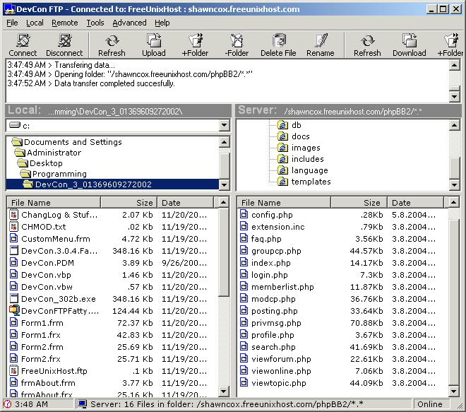



## DevCon FTP 3\.0\.4

### Description

This is an update to DevCon FTP 3.0.3. It is now DevCon FTP 3.0.4 Fatty Edition. I am not the original author of this code. I have mearly fixed things, and added functionality to this program. It now has the ablity to CHMOD files, and as it appears, is the first to have it on PSC. CHMOD might not work, I have no FTP to test it on, my host doesn't support these commands. But from what I gathered on the web, it SHOULD work. If it doesn't, it won't take much modification to get it working. There is a list of changes in the zip, as well as the original PSC readme.
 
### More Info
 

             |
---                |---
**Submitted On**   |2004-11-20 03:44:38
**By**             |[Shawn J Cox](https://github.com/Planet-Source-Code/PSCIndex/blob/master/ByAuthor/shawn-j-cox.md)
**Level**          |Intermediate
**User Rating**    |4.0 (16 globes from 4 users)
**Compatibility**  |VB 6\.0
**Category**       |[Internet/ HTML](https://github.com/Planet-Source-Code/PSCIndex/blob/master/ByCategory/internet-html__1-34.md)
**World**          |[Visual Basic](https://github.com/Planet-Source-Code/PSCIndex/blob/master/ByWorld/visual-basic.md)
**Archive File**   |[DevCon\_FTP18202511202004\.zip](https://github.com/Planet-Source-Code/shawn-j-cox-devcon-ftp-3-0-4__1-57336/archive/master.zip)

